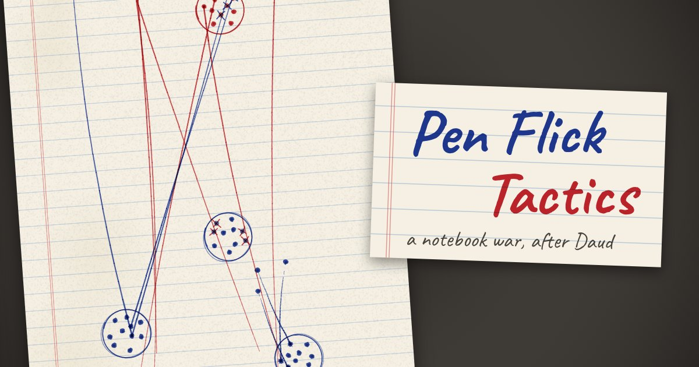

# Dotfight



**[Play it →](https://dotfight.vercel.app)** · **[Read the rules →](https://dotfight.vercel.app/rules)**

Dotfight is a war fought with a ballpoint pen on the back page of an exercise book.

Each side draws a few circle camps and fills them with dots: those are your soldiers. On your turn you pick up one soldier, pull the pen back, and flick. The ink line crosses out every enemy dot it passes through. Nothing is ever erased. The page fills up with lines and crosses until one side has no one left standing.

The flick is never quite where you meant it. A soft flick is short and careful; a hard one reaches across the page and goes a little wild. The whole game lives in that gap between what you aimed and what the pen did.

## Where it comes from

Dawood made this game up at school. He and Burooj played it in grades 5 and 6, with ballpoint pens, and nobody ever wrote the rules down. Twenty years later, this is those rules remembered, argued over, tested and written out properly, with Dawood checking what we got wrong.

## Playing

- **Against Dawood-bot**: sloppy, steady or sharp.
- **Pass and play**: two of you, one phone. The sheet turns round on the desk to face whoever's go it is.
- **Finished pages** are signed and filed in the drawer, where you can replay them or save them as a picture.

It's made for phones. Touch one of your soldiers to lean in over him, slide sideways to turn the page under your thumb, pull down anywhere on the screen, let go (slide back to where you started to cancel), and watch the ink land from above.

## The rules

The rules are in two books, drawn by hand:

- **[Core rules](https://dotfight.vercel.app/rules)**: Quick battle, Dawood's game. Snipe, lunge, send, last stand.
- **[Long war rules](https://dotfight.vercel.app/rules/advanced)**: book 2, with shaped bases, gravity wells, billiards cushions and ink that fights back.

The same rules are in plain text in [RULES.md](RULES.md). The playable game still runs the first, simpler rules; the new ones are being tested and brought in.

## Coming

Sharing a room link so you can play a friend without passing the phone, a real-time mode, a tutorial you play rather than read, and app-store versions for Android and iPhone.

## Building it

```bash
npm install
npm run dev      # http://localhost:5173
npm test
```

Working on the code, or an agent working on it? Start with [AGENTS.md](AGENTS.md). On bjslab, tests and browser scripts run through the `t3-test-run` guard; AGENTS.md explains.
